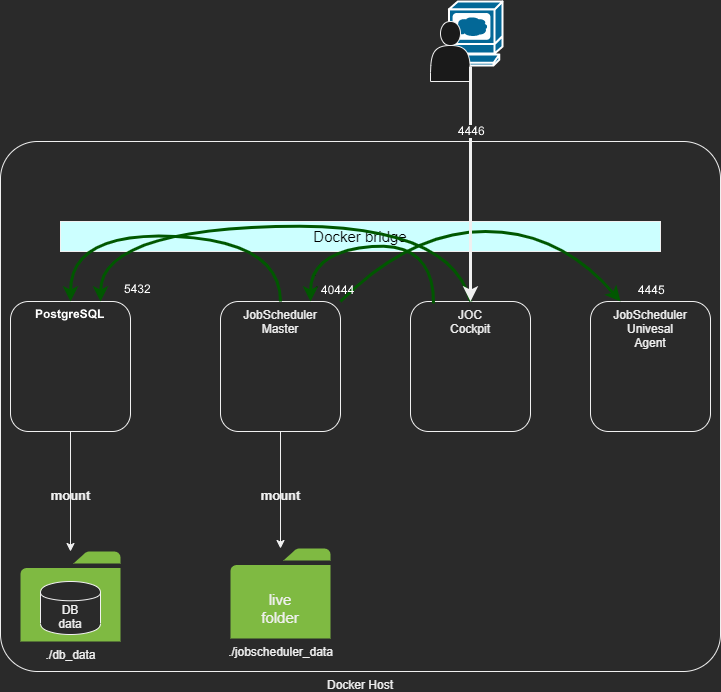

# SOS JobScheduler docker compose files

## Architecture



## Usage

```
$ git clone https://[Git Link]
$ cd jobscheduler-compose
$ vim .env # Please change your settings
$ docker-compose up -d
```

Install process, that's all!

By default, installed JobScheduler 1.13.9.
If you want to change the version, set each Dockerfile.

And you can access to JOC Cockpit by your web browser.

http://[your docker host]:4446

default JOC Cockpit username/password -> root/root

Source https://github.com/ike-dai/jobscheduler-compose.git MySQL

Suitable for PostgreSQL version and newer software version 1.13.9
